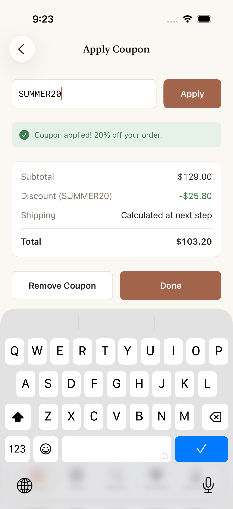
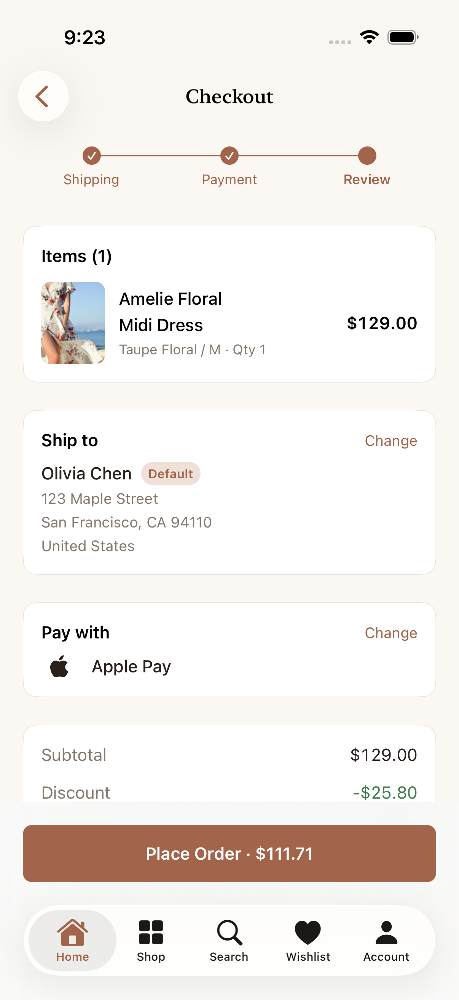
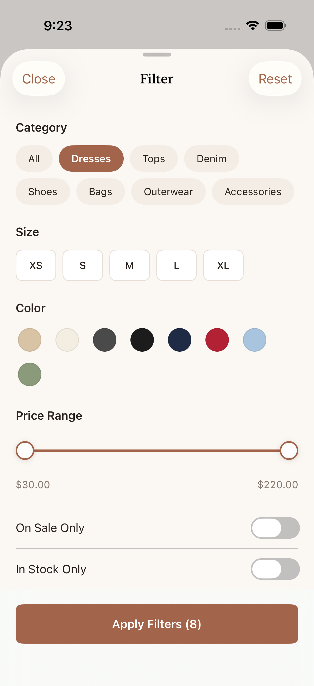
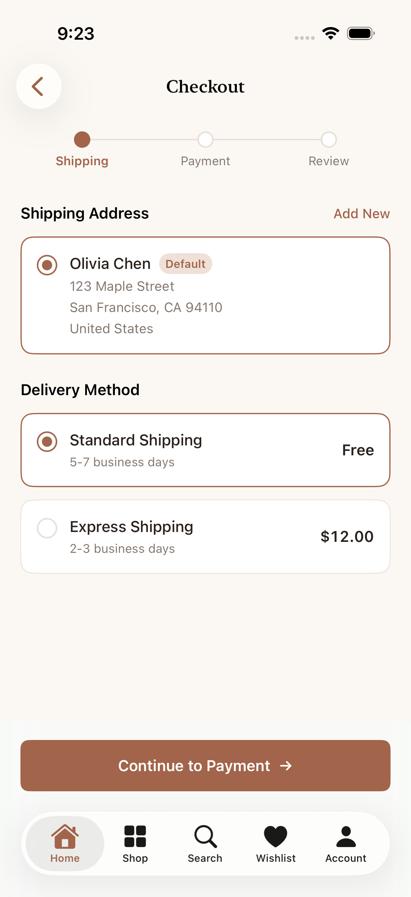
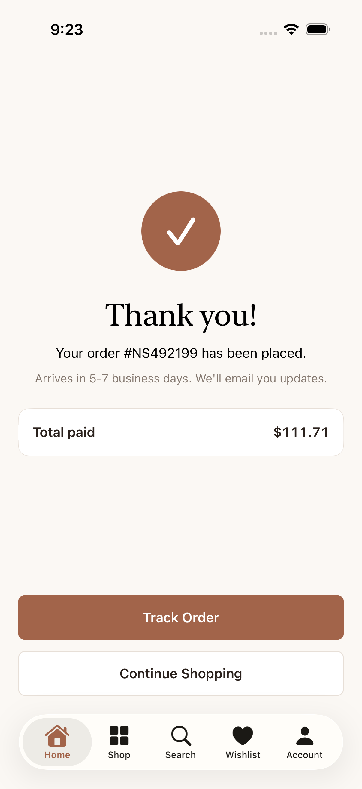
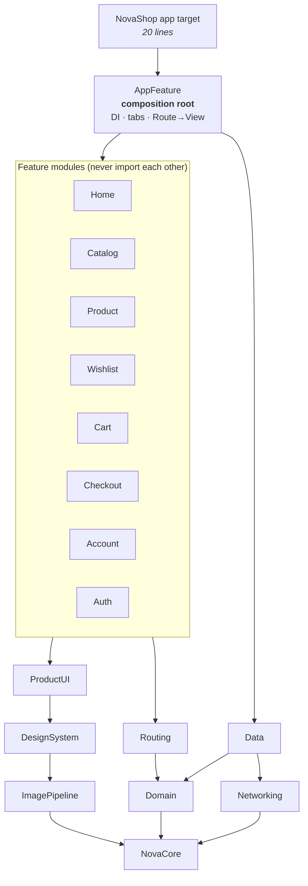
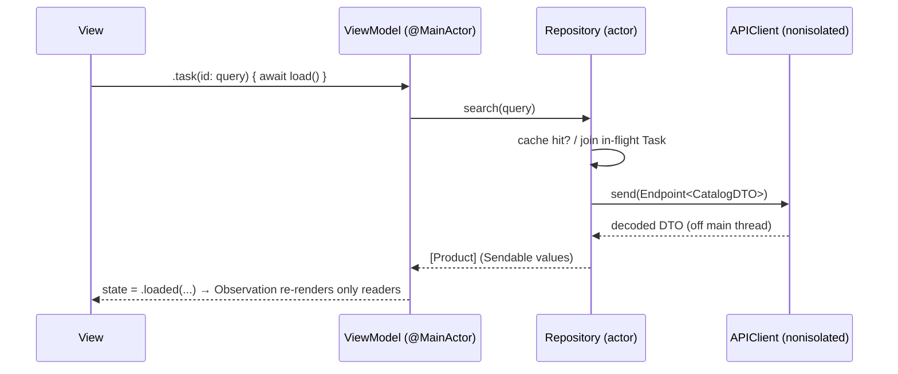

<div align="center">


# NovaShop

**A production-grade SwiftUI fashion commerce app — modular, Swift 6 strict-concurrency clean, measured, and tested.**


-3ECF8E?logo=supabase&logoColor=white)


</div>

<p align="center">
  
  
  
  
  
</p>
<p align="center">
  
  
  
  
  
</p>

> Screenshots are captured automatically by a UI test (`make screenshots`) — the same pipeline a team
> would use for App Store assets. Photography: Unsplash.

---

## TL;DR for reviewers

| | |
|---|---|
| **Scope** | 30+ screens from the design: home, categories, collections, search + type-ahead, filter/sort sheets, product detail, zoomable gallery, size guide, reviews, wishlist, cart, coupons, 3-step checkout, addresses, cards, payment processing, confirmation, orders + tracking, returns, notifications, account, settings, auth + style quiz. |
| **Architecture** | MVVM with `@Observable`, 18 SPM modules, compiler-enforced layering, typed `Route` navigation, single composition root. [Why →](#architecture) |
| **Concurrency** | Swift 6 language mode, *complete* checking, **0 warnings**. Actors for state, `async let` / task groups, view-bound cancellation, single-flight requests, `#isolation`-inheriting helpers. [How →](#swift-concurrency) |
| **Performance** | Launch work deferred until after first frame, static linking (0 embedded frameworks), ImageIO downsampling + CDN width buckets (**2.3 MB → 34 KB** per image), signposts on every critical path, MetricKit in the field. [Numbers →](#performance) |
| **Backend** | Supabase (Postgres + Auth + Row Level Security) through **our own REST layer — no SDK**. Checkout is one server transaction (locks stock, prices from the DB, idempotent). Runs on bundled demo data when no backend is configured. [Details →](#backend-supabase--security) |
| **Offline-first** | Cart & wishlist are local-first: instant writes, per-record sync state, coalesced uploads, server-wins reconciliation, background sync. Network monitoring, 401 → refresh → retry, typed error handling. [Details →](#offline-first-cart--sync) |
| **Quality** | 115 unit tests (swift-testing) across 6 targets + critical-path UI tests + automated screenshots. SwiftLint `--strict` clean. CI on every PR. |
| **App Store readiness** | Privacy manifest, in-app account deletion, guest browsing (5.1.1), Dynamic Type, VoiceOver, Reduce Motion, dark mode, haptics, Keychain for secrets. |
| **Dependencies** | **Zero** third-party packages. |

---

## Contents
1. [Getting started](#getting-started)
2. [Architecture](#architecture)
3. [Backend: Supabase & security](#backend-supabase--security)
4. [Offline-first cart & sync](#offline-first-cart--sync) — network monitoring, error handling
5. [Swift concurrency](#swift-concurrency)
6. [Performance](#performance) — launch, scrolling, images, memory
7. [Debugging performance: tools & playbooks](#debugging-performance-tools--playbooks)
8. [Testing strategy](#testing-strategy)
9. [Accessibility, privacy & App Store readiness](#accessibility-privacy--app-store-readiness)
10. [Bugs the process caught](#bugs-the-process-caught)
11. [Project structure & tooling](#project-structure--tooling)
12. [Trade-offs & next steps](#trade-offs--next-steps)

---

## Getting started

**Requirements:** Xcode 16+ (built and verified with Xcode 26.0.1 / iOS 26 simulator), iOS 17 deployment target.

```bash
git clone https://github.com/devzahirul/NovaShop-iOS.git
cd NovaShop-iOS
open NovaShop.xcodeproj          # ▶︎ Run — no setup, no API keys, no package downloads
```

Everything runs offline-first against a realistic fixture API. Useful targets:

```bash
make help          # list everything
make test          # unit + UI tests
make lint          # SwiftLint --strict + SwiftFormat --lint
make launch-bench  # cold-launch benchmark (Release)
make screenshots   # regenerate docs/screenshots
make project       # regenerate the .xcodeproj from project.yml (XcodeGen)
```

Launch arguments: `-ui-testing` (in-memory persistence, zero latency), `-signed-in` (demo account),
`-no-latency`. Deep links: `novashop://product/amelie-floral-midi`, `novashop://search?q=linen`,
`novashop://cart`. Coupons: `SUMMER20`, `WELCOME10`, `NOVA25` (min $150). Test card `4242 4242 4242 4242`;
any card ending **0002** is declined to exercise the failure path.

---

## Architecture

### The shape



| Module | Responsibility | Knows about |
|---|---|---|
| `NovaCore` | Logging, signposts, launch timeline, `LoadState`, `AppConfiguration` | nothing |
| `Domain` | Models, **pure business logic** (filtering, pricing, validation), service **protocols**, shared `@Observable` stores | NovaCore |
| `Networking` | `Endpoint<Response>`, `APIClient` (retries, error mapping), `HTTPTransport` | NovaCore |
| `Data` | Adapters: DTOs + mapping, fixture transport, single-flight catalog cache, file/Keychain persistence | Domain, Networking |
| `ImagePipeline` | Download → downsample → cache, request coalescing, CDN sizing | NovaCore |
| `DesignSystem` | Colour/type/spacing tokens, buttons, fields, chips, skeletons, `RemoteImage` | ImagePipeline |
| `ProductUI` | Product card, grid, wishlist heart, cart badge — shared by several features | Domain, DesignSystem, Routing |
| `Routing` | `Route` / `AppTab` values, `Router` state, deep-link parser | Domain |
| `*Feature` | Screens + view models | Domain, DesignSystem, ProductUI, Routing |
| `AppFeature` | Builds concrete services, wires stores into the environment, maps `Route` → view | everything |

### Why this architecture

**MVVM + Observation, not TCA/VIPER.** The app is "load → render → mutate a few shared stores".
`@Observable` gives per-property dependency tracking for free (the tab badge re-renders on a cart change;
the product grid doesn't), view models are plain classes you can test with a function call, and there is
zero third-party surface. TCA's guarantees are real but its cost (dependency, compile time, reducer
boilerplate on simple screens) isn't justified here; VIPER fights SwiftUI's data flow. Full reasoning in
[ADR 0001](docs/adr/0001-mvvm-with-observation.md).

**Modules as the unit of isolation.** A feature *cannot* import another feature or the data layer — the
compiler enforces what code review usually has to. It also buys incremental builds (touch Cart, rebuild
Cart), per-module test targets, and static linking. [ADR 0002](docs/adr/0002-spm-modularization.md).

**Ports & adapters at the data boundary.** Features depend on `CatalogRepository`, `OrderService`,
`ProfileRepository`… protocols in `Domain`. The composition root chooses fixtures, a live API, or
in-memory fakes. Fixtures are served **through the real networking stack**
([ADR 0003](docs/adr/0003-fixture-transport.md)), so DTO decoding, retries and threading are exercised
on every run and by contract tests.

### Data flow



- **State is an enum.** `LoadState<Value>` = `idle | loading | loaded | failed(UserFacingError)`.
  Errors are mapped once to user-facing copy (`UserFacingConvertible`); raw `localizedDescription` never
  reaches a screen.
- **Shared state = small stores.** `CartStore`, `WishlistStore`, `RecentlyViewedStore`, `SearchHistoryStore`,
  `SessionStore` — injected once with `.environment(_:)`. One source of truth per concept.
- **Business rules are pure functions.** `ProductFilterEngine`, `PricingCalculator` (`Decimal`, banker's
  rounding — 20 % of $277.00 is exactly $55.40), `Validation` (Luhn, expiry against an injected date).
  They're shared by UI and repository and table-tested.

### Navigation

`Route` is a `Hashable` enum; each tab owns a `NavigationStack(path:)` stored in the `Router`.
Features call `router.push(.product(id, preview: product))` and never construct another feature's view —
`AppFeature/Destinations.swift` is the only `Route → View` map.

Because navigation is plain state it is unit-tested: per-tab stacks, re-tap-to-pop-to-root, deep links,
and **auth gating** — pushing `.checkout` as a guest presents sign-in and *resumes* checkout afterwards,
instead of dumping the user back at the cart.

---

## Backend: Supabase & security

The app talks to **Supabase** (free tier: Postgres, Auth, auto-generated REST, Row Level Security)
through the same `APIClient` as everything else — **no Supabase SDK**. Features depend on `Domain`
protocols; the Supabase adapters live in one folder (`Data/Supabase`). Swapping the backend for
Spring Boot or Firebase means rewriting that folder, not the app. ([ADR 0006](docs/adr/0006-supabase-backend.md))

```
SwiftUI ─► ViewModel ─► Store / Repository protocol (Domain)
                             │
          ┌──────────────────┴──────────────────┐
   LocalFirstRepository (disk)          Supabase adapters (Data/Supabase)
                                                  │  APIClient + SupabaseAuthorizer
                                                  ▼
                        PostgREST /rest/v1  ·  GoTrue /auth/v1  ·  RPC functions
                                                  ▼
                              Postgres + Row Level Security (auth.uid())
```

| Concern | How |
|---|---|
| **Who can see what** | Every user table has RLS `user_id = (select auth.uid())` (the sub-select is evaluated once per statement, not per row). Catalog is public read-only. Coupons have *no* policy — invisible to clients. |
| **Keys** | Only the *publishable* key ships (git-ignored `Config/Supabase.local.xcconfig`). The secret/service key never leaves the server. |
| **Checkout** | `place_order()` — one `SECURITY DEFINER` transaction: lock product rows in a stable order (no deadlocks) → validate stock → **price from the database** (client can't tamper) → apply coupon → insert order + snapshot lines → decrement stock → clear cart. |
| **Double-charge safety** | Each checkout attempt carries an **idempotency key**; a retry after a timeout returns the *first* order. That's what makes the checkout `POST` safe to retry automatically. |
| **Auth** | GoTrue REST; tokens in the **Keychain**; proactive refresh 60 s before expiry; **single-flight** refresh on 401 (8 concurrent 401s → 1 refresh — tested); revoked refresh token → session ends, user is asked to sign in. |
| **Account deletion** | `delete_my_account()` RPC (App Review 5.1.1(v)) — no admin key in the client. |
| **No backend?** | Without the xcconfig the app runs on bundled fixtures through the same pipeline — clone-and-run for reviewers, deterministic UI tests. |

Setup takes ~5 minutes on the free tier — see [`supabase/README.md`](supabase/README.md).

---

## Offline-first cart & sync

The **cart and wishlist are local-first**: every change is written to the device immediately and
synced later. The catalog is cached for offline browsing; **checkout, payment and orders are
online-only by design** ("You're offline. Connect to complete checkout." — your bag is saved).
([ADR 0005](docs/adr/0005-offline-first-cart-sync.md))

```
tap ─► SyncedList (@MainActor)          instant UI, optimistic
          │ SerialTaskQueue             ordered disk writes
          ▼
       SyncedCollection (actor, disk)   per-record state: synced · pendingUpsert · pendingDelete (+version)
          │ sync()  ◄── SyncCoordinator ◄── launch · foreground · network restored · sign-in
          ▼                                  debounced change (600 ms) · Background App Refresh
       push upserts ─► push deletes ─► pull server ─► reconcile
```

**Why state-based sync, not an operation log:** ten quantity taps while offline become **one**
upsert of the final value; upserts are absolute, so a retried request is harmless; a delete of a
never-synced line needs no request at all.

**Reconciliation:** records the user hasn't touched follow the server (changes and deletions from
other devices flow in); records with pending local edits keep the local value until it's uploaded;
a push only marks a record synced if it wasn't edited *during* the request (version check —
there's a test that pauses the server mid-upsert and edits the cart to prove it).

**Error handling — every failure has a deliberate response:**

| Failure | Response |
|---|---|
| Offline / DNS / connection lost | Keep changes pending, show *"Saved on this device · will sync when you're online"*; **no polling** — `NWPathMonitor` triggers a sync the moment connectivity returns |
| Timeout · 5xx · 429 | Idempotent requests retried with exponential backoff (300 ms…); sync passes retry at 2 → 4 → 8 … 60 s |
| 401 | Refresh the token once (single-flight) and replay the request; if the refresh token is revoked → sign-in prompt |
| 4xx rejection (e.g. discontinued product) | **Don't retry blindly**: isolate the offending record, drop it locally, tell the user *"… is no longer available and was removed from your bag."* |
| Checkout: out of stock / declined / coupon | Typed errors from the server transaction → clear copy; the cart re-syncs to show what's actually available |
| Checkout while offline | Refused up front — never a half-placed order |

**Network monitoring caveat:** a satisfied `NWPath` means a route exists, not that *our server* is
reachable (captive portal, DNS, outage). The monitor is used as a hint for UX and instant recovery;
correctness always comes from the actual request outcome.

**See it:** Settings → *Data & Sync* shows the backend, connection and bag sync state, has
**Sync Now**, and (Debug builds) **Simulate Offline** — which makes the transport fail exactly like
airplane mode, so offline behaviour can be demoed without touching the device settings.

---

## Swift concurrency

Swift 6 language mode, complete strict-concurrency checking, **0 warnings, 0 `@preconcurrency`**.
The full model is in [ADR 0004](docs/adr/0004-swift-concurrency-model.md); the highlights:

| Technique | Where | What it buys |
|---|---|---|
| `@MainActor @Observable` | view models, stores, router | UI state mutated only on main — races impossible by construction |
| `actor` | `RemoteCatalogRepository`, `ImagePipeline`, `FileStore`, local services | lock-free, race-free caches and I/O |
| `nonisolated async` + `Sendable` structs | `APIClient` | JSON decoding runs on the cooperative pool, never the main thread |
| `async let` | home feed, listing, checkout load, launch bootstrap | independent work in parallel, cancelled together |
| `withTaskGroup` | image prefetch | bounded, low-priority parallelism |
| `.task` / `.task(id:)` | every screen | work is tied to view lifetime; `.task(id: query)` cancels stale searches |
| Debounce by cancellation | search type-ahead | `try await clock.sleep(for: 250ms)` inside `.task(id: text)` — the next keystroke cancels the sleep. No Combine, no timers |
| Single-flight | catalog + images | N concurrent callers share **one** request (`inFlight: Task`) — verified by a test |
| `withTaskCancellationHandler` | image pipeline | downloads are cancelled when the last interested cell scrolls away |
| Ordered writes (`SaveQueue`) | persistence | unstructured tasks aren't FIFO; chaining prevents a stale snapshot resurrecting a deleted cart item |
| `isolation: isolated (any Actor)? = #isolation` | `Perf.measure` | helper runs on the *caller's* actor, so main-actor code can pass non-`Sendable` closures without a hop |
| `any Clock<Duration>` injection | search debounce, API retry backoff | tests use `ImmediateClock` — **no `sleep` in tests** |

---

## Performance

### Measured

| Metric | Result | How measured |
|---|---|---|
| `App.init` → first frame | **~232–277 ms** warm-cache (481 ms fully cold) | `make launch-bench`, Release, iPhone 17 simulator, 6 runs, in-app `LaunchTimeline` signposts |
| `App.init` → home content rendered | **~470–540 ms** (808 ms fully cold) | same (includes fixture fetch + decode + first layout) |
| Embedded dynamic frameworks | **0** | SPM modules link statically |
| App binary (arm64, stripped, Release) | **2.8 MB** (bundle 3.0 MB) | `make size` |
| Bytes per grid image | **2.3 MB → 34 KB** (≈ 25–70×, 3 samples) | original vs `w=480` CDN bucket |
| Decoded memory per grid image | **~96 MB → ~1.1 MB** | 6016×4000×4 B full decode vs 450×600 downsample |
| Catalog search over 10 000 products | **< 500 ms budget, enforced in CI** | `searchPerformanceBudget` test |

> Simulator numbers run on Apple silicon and are *not* device numbers — they are used for **trend
> tracking**. Device truth comes from Instruments' App Launch template on the oldest supported device and
> from MetricKit/Organizer in the field (see below). `testLaunchPerformance` (`XCTApplicationLaunchMetric`)
> guards regressions.

### How launch time is optimized

Launch = **pre-main** (dyld, static initializers) + **`App.init` → first frame** + **first frame → useful content**.
Each phase has its own rule:

1. **Pre-main: less for dyld to do.**
   - All 18 modules are static libraries → one binary, no framework loading/binding at launch.
   - No `+load`, no global initializers with side effects (Swift globals are lazy), no storyboards
     (`UILaunchScreen` in Info.plist is a colour, rendered by the system).
   - System fonts only: the editorial serif is Apple's **New York** (`.fontDesign(.serif)`) — no font
     files to register.
2. **`App.init` does no I/O.** `AppContainer.init` only allocates objects. Keychain session restore,
   cart/wishlist/recents hydration and MetricKit registration happen in `bootstrap()` **after the first
   frame**, concurrently via `async let`.
3. **Guest-first UI.** Session state starts as `.restoring` and the UI renders as a guest — launch never
   blocks on auth.
4. **Hydration can't lose data.** If a user adds to cart before the disk load finishes, `CartStore.hydrate()`
   merges instead of overwriting (tested).
5. **Deferred, low-priority extras.** `DeferredLaunchWork` starts MetricKit at `.background` priority.
6. **Content ASAP.** Home fires three requests in parallel (`async let`); the repository single-flights
   them into one network call; a layout-matched skeleton renders meanwhile (no layout shift).

### How scrolling stays smooth

- `LazyVStack` / `LazyVGrid` / `LazyHStack` everywhere content is unbounded; stable `Identifiable` ids.
- `ProductCard` is `Equatable` and used with `.equatable()`, so unchanged cells skip body evaluation.
- The wishlist keeps a `Set` index — the heart's `contains` is O(1) for every visible cell.
- **Image pipeline** ([`ImagePipeline.swift`](Packages/NovaKit/Sources/ImagePipeline/ImagePipeline.swift)):
  - CDN width buckets → download ~the pixels we draw.
  - ImageIO `CGImageSourceCreateThumbnailAtIndex` with `kCGImageSourceShouldCacheImmediately` → decode
    **at target size, off the main thread**. The main thread never pays for JPEG decode.
  - Synchronous memory-cache lookup during render → recycled cells show the image in the first frame, no
    placeholder flicker.
  - Request coalescing + cancellation when the last requester goes away.
  - `URLCache` (250 MB disk) for relaunch hits; `NSCache` with cost = decoded bytes, auto-evicting under
    memory pressure.
- Animations are `snappy` springs on transforms/opacity; Reduce Motion swaps shimmer and spinners for static
  states.

### How network time was reduced
- Single-flight + 5-minute in-memory catalog cache: Home, Shop and Search share one request.
- Review pages cached per product; product detail renders instantly from the tapped card's data
  (`preview`), then refreshes.
- Retries only for idempotent methods, exponential backoff, never for `POST` (no double orders — tested).
- Search is debounced and cancellable; superseded queries never reach the network (tested).

---

## Debugging performance: tools & playbooks

### Instrumentation built into the app

| Signal | Where | See it in |
|---|---|---|
| `Launch.FirstFrame`, `Launch.HomeContent`, `Launch.Bootstrap` signpost intervals | `NovaCore/Perf.swift`, `RootView` | Instruments → Points of Interest |
| `Catalog.Fetch`, `Catalog.Search` | catalog repository | Points of Interest, aligned with Time Profiler |
| `Image.Fetch` vs `Image.Decode` per image | image pipeline | tells network-bound from CPU-bound instantly |
| Structured `os.Logger` (subsystem `com.novashop.app`, categories app/network/persistence/images/navigation/performance) | everywhere; **no `print`** | Console.app, `log stream` |
| MetricKit launch / hang histograms & crash/hang diagnostics | `DeferredLaunchWork.swift` | field data, daily |
| Launch timings (DEBUG only) | Settings → About | on-device, no tools needed |

```bash
# Live logs from the simulator
xcrun simctl spawn booted log stream --level debug --predicate 'subsystem == "com.novashop.app"'
# Launch trace from the command line (device or simulator)
xcrun xctrace record --template 'App Launch' --launch -- /path/to/NovaShop.app
```

### Tools and when to reach for them

| Problem | Tool | What to look for |
|---|---|---|
| Slow launch | **Instruments › App Launch** (+ Points of Interest) | dyld/static-init time; main-thread work before `Launch.FirstFrame`; anything I/O-shaped in that window |
| Janky scroll / dropped frames | **Instruments › Animation Hitches**, **Time Profiler** | hitch reasons; main-thread stacks in image decode, layout, formatting |
| Too many view updates | **Instruments › SwiftUI** (view body counts, update causes); `Self._printChanges()` in DEBUG | bodies re-evaluating for state they don't read; unstable ids |
| Hangs | **Instruments › Hangs**, Xcode Organizer › Hangs, MetricKit `MXHangDiagnostic` | synchronous work > 250 ms on main |
| Memory growth / leaks | **Memory Graph Debugger**, Instruments › Allocations + Leaks | retain cycles in stored closures; image bytes vs `NSCache` cost limit |
| Network waste | **Instruments › Network**, Charles/Proxyman | duplicate requests (should be single-flighted), oversized images |
| Concurrency | **Instruments › Swift Concurrency** (tasks, actors) | actor contention, task explosions, main-actor hops |
| Field regressions | **Xcode Organizer** (launch, hangs, memory, disk writes), **MetricKit** | trends per version on real devices |
| Regressions in CI | `XCTApplicationLaunchMetric`, performance-budget unit tests, `make launch-bench` | fails the build instead of shipping the regression |

### Playbook: "launch got slower"
1. `make launch-bench` on `main` vs the branch → confirm and size the regression.
2. Instruments › App Launch, Release build, **oldest supported device**. Compare the pre-main slice
   (new dynamic framework? static initializer?) and the `Launch.FirstFrame` interval.
3. Time Profiler on the main thread inside that interval → find the I/O or heavy init.
4. Fix by *deferring* (move to `bootstrap()`), *parallelising* (`async let`), or *removing* it.
5. Keep the guard: the launch UI test and signposts make the regression visible next time.

### Playbook: "scrolling hitches in the grid"
1. Animation Hitches template → confirm commit/render hitches, find the frame.
2. Time Profiler with *Hide System Libraries* off → decode on main? (`Image.Decode` interval should never
   be on the main thread). Oversized bitmaps? (Allocations: look for multi-MB `CGImage`s.)
3. SwiftUI template → are cells re-rendering on unrelated changes? Check `Equatable` / stable ids /
   observation reads.

---

## Testing strategy

```
          ┌───────────────┐   3 UI flows + launch metric + automated screenshots (XCUITest)
          │   UI tests    │   purchase w/ coupon · guest → auth gate → resume · wishlist
        ┌─┴───────────────┴─┐
        │ View-model tests  │   Home, Search (debounce/cancel), Listing, Product, Checkout,
        │                   │   forms (card, coupon, sign-in/up) — no views rendered
      ┌─┴───────────────────┴─┐
      │ Domain / data / infra │   filtering, pricing, validation, local-first sync & reconciliation,
      │    (the bulk)         │   token refresh, error mapping, DTO contract, persistence, deep links
      └───────────────────────┘
```

- **115 unit tests** in 6 targets with **swift-testing** (`@Test`, `#expect`, parameterized tables,
  `#require`), all green in ~0.1 s of test time.
- Hand-written fakes in `TestSupport` (`FakeCatalogRepository`, `InMemoryPersistence`, `ImmediateClock`…) —
  they behave like the real adapters, so tests read as behaviour, not mock choreography.
- Deterministic: injected clocks and dates, in-memory stores, zero-latency transport. **No `sleep`** in
  any functional test.
- Contract tests decode the fixture API through production DTOs.
- A performance budget test fails CI on accidental O(n²) search.

```bash
make test-unit   # all NovaKit modules
make test-ui     # critical paths on the simulator
```

---

## Accessibility, privacy & App Store readiness

**Accessibility**
- Dynamic Type everywhere: every font is a text style (serif via `design: .serif`); no fixed sizes for text.
- VoiceOver: labels on every icon button, combined elements for cards/rows, `.isSelected` / `.isHeader`
  traits, adjustable actions on the quantity stepper and **both thumbs of the price slider**, zoom action on
  the gallery.
- 44 pt minimum hit targets (icon buttons draw 32 pt, hit-test 44 pt).
- Reduce Motion honoured (shimmer, spinners, transitions, image fades).
- Semantic colour tokens resolve light/dark dynamically; screens never branch on `colorScheme`.
- Haptics only on meaningful state changes (add to cart, coupon applied, order placed, size missing).

**App Review**
- Browsing never requires an account (guideline 5.1.1); sign-in is requested at checkout/orders only.
- In-app **account deletion** (5.1.1(v)) with confirmation.
- `PrivacyInfo.xcprivacy` declares collected data and required-reason APIs (`UserDefaults`, file timestamps).
- `ITSAppUsesNonExemptEncryption = NO`, portrait-only iPhone, system launch screen.

**Security**
- Session token in the **Keychain** (`AfterFirstUnlockThisDeviceOnly`), never `UserDefaults`.
- Files written with `.completeFileProtectionUntilFirstUserAuthentication` and atomic writes.
- Cards: only brand + last four + expiry are persisted; the PAN/CVV would go straight to the payment
  provider's SDK. Card data never appears in logs.
- ATS defaults (HTTPS only); deep links are allow-listed by host and parsed by a tested pure function.

---

## Bugs the process caught

The screenshots and UI tests found real issues:

1. **Aspect-fill images stole taps from neighbours.** `.clipped()` clips *pixels*, not hit-testing or
   accessibility frames — the "Dresses" tile's accessible frame overlapped "Tops", so a tap (and VoiceOver
   focus) could land on the wrong category. Fixed at the source in `RemoteImage`
   (`allowsHitTesting(false)` + hidden bitmap + `contentShape`).
2. **Form fields were invisible to VoiceOver as fields.** `.accessibilityElement(children: .combine)` on
   the custom text field turned it into static text — VoiceOver couldn't edit it and XCUITest couldn't find
   it. Now the label is spoken as the field's label and errors as its hint.
3. **"Add to Cart" without a size failed silently.** The inline error rendered below the fold, under the
   sticky button. Now the page scrolls the size picker into view with an error haptic — and the UI test
   drives exactly that path.
4. **Non-deterministic password hash.** An early draft used `hashValue`, which Swift seeds per process —
   replaced with SHA-256 before it could break sign-in across launches.

---

## Project structure & tooling

```
NovaShop/
├── App/                      # 20-line @main shell, assets, PrivacyInfo.xcprivacy
├── Packages/NovaKit/
│   ├── Package.swift         # layering documented at the top
│   ├── Sources/
│   │   ├── NovaCore/ Domain/ Networking/ Data/ ImagePipeline/
│   │   ├── DesignSystem/ ProductUI/ Routing/
│   │   ├── HomeFeature/ CatalogFeature/ ProductFeature/ WishlistFeature/
│   │   ├── CartFeature/ CheckoutFeature/ AccountFeature/ AuthFeature/
│   │   ├── AppFeature/       # composition root
│   │   └── TestSupport/      # fakes shared by tests
│   └── Tests/                # 6 swift-testing targets
├── UITests/                  # critical flows + screenshot capture
├── docs/adr/                 # architecture decision records
├── docs/screenshots/         # generated by `make screenshots`
├── scripts/                  # fixture generator, launch bench, screenshot export
├── project.yml               # XcodeGen spec (the .xcodeproj is generated)
├── Makefile · .swiftlint.yml · .swiftformat · .github/workflows/ci.yml
```

| Tool | Use |
|---|---|
| **XcodeGen** | project generated from `project.yml` → no `.pbxproj` merge conflicts |
| **SwiftLint** (`--strict`) + **SwiftFormat** | style gate in CI; lint lives in CI/pre-commit, not in a build phase, so incremental builds stay fast |
| **GitHub Actions** | lint → unit tests → UI tests → Release build with warnings as errors |
| **xcbeautify** | readable CI logs |
| **Instruments / xctrace, MetricKit, os_signpost, os.Logger** | performance work (see above) |

---

## Trade-offs & next steps

Deliberate choices, stated plainly:

- **Backend.** Supabase free tier when configured, bundled fixtures otherwise — both behind the same
  protocols. Realtime subscriptions (live cart updates across devices without a refresh) are the
  next step; today other devices' changes arrive on the next sync trigger.
- **Payments.** The Apple Pay / PayPal / card UI is complete, but no PSP is integrated. Next: PassKit
  `PKPaymentAuthorizationController` + a provider SDK for tokenisation.
- **Sign in with Apple/Google** buttons call a local adapter; production would use
  `ASAuthorizationController` (needs a team entitlement).
- **Localization.** Copy is English; strings are ready to move into a String Catalog.
- **Snapshot tests.** Automated screenshots exist; pixel-diff snapshot tests (swift-snapshot-testing) are
  the next layer, deliberately skipped to keep zero dependencies.
- **Pagination.** The catalog is small enough to page on the client; a real catalog would page
  server-side through the same `ProductQuery`.

---

<sub>Design: "NovaShop — E-commerce App UI Design". Photography from Unsplash. Code © 2026, MIT licensed.</sub>
